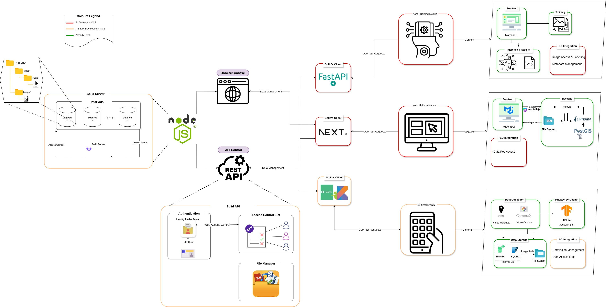

# DUME Project Overview

Welcome to the DUME repository! This project consists of three main components: Solid Server, BackOffice, and TheiaVision App.

## Project Description

Urban environments face a myriad of challenges, from waste mismanagement to infrastructure deterioration, which necessitate robust monitoring and management systems. Traditional centralized platforms, such as Theia Vision, though effective, often compromise user data sovereignty and privacy. Project DUME addresses these concerns by shifting towards a decentralized framework, thereby enhancing data control, privacy, and user engagement.

To achieve these goals, Project DUME leverages the Solid Protocol to handle large-scale media datasets in a decentralized manner. The key developments implemented include extending the Solid Protocol for efficient media data management to be used on advanced AI models like EfficientDet and YOLO for real-time urban event detection and characterization. These technological advancements enable seamless and efficient management of urban data while maintaining user sovereignty over their contributions.

## Project Architecture

Below is the architecture diagram of the DUME project:




## Components

### Solid Server

The **Solid Server** is an implementation of the [Solid Protocol](https://solidproject.org/), designed to decentralize data storage and management. Our implementation is based on [node-solid-server](https://github.com/nodeSolidServer/node-solid-server), which provides secure and scalable decentralized data management.

For more details about Solid, check out the [Solid Project](https://solidproject.org/about).

[SolidServer](SolidServer/README.md): Documentation for the Solid Server.

### BackOffice

The **BackOffice** application is built using Next.js. It serves as the administrative interface for managing the various aspects of the Solid Server and TheiaVision App. The BackOffice provides functionalities for user management, data administration, and system monitoring, allowing administrators to oversee the decentralized network effectively.

[BackOffice](BackOffice/README.md): Documentation for the BackOffice application.

### TheiaVision App

The **TheiaVision App** is a mobile application developed using Flutter. The app is designed to offer a user-friendly interface for interacting with the Solid Server and accessing decentralized data. It supports advanced AI models like EfficientDet and YOLO for real-time urban event detection and characterization. The app is available for download on the Google Play Store.

[Download TheiaVision App](https://play.google.com/store/apps/details?id=com.logimade.theia_vision_app)


[TheiaVision_App](TheiaVision_App/README.md): Documentation for Theia Vision App.
## Getting Started

To get started with any of these components, follow the instructions below.

### AI Models API

The **AI Models API** provides a collection of machine learning and deep learning models designed to process and analyze data for TheiaVision and other integrated applications. This API supports functionalities such as image recognition, object detection, and data anonymization, ensuring efficient and scalable AI-driven solutions.

[AI Models API Documentation](AIModelsAPI/README.md): Detailed information about the AI Models API.


### Solid Server

1. **Clone the repository:**
    ```bash
    git clone https://github.com/NGI-TRUSTCHAIN/DUME.git
    cd DUME/SolidServer
    ```

2. **Install dependencies:**
    ```bash
    npm install
    ```

3. **Run the server:**
    ```bash
    npm start
    ```

### BackOffice

1. **Clone the repository:**
    ```bash
    git clone https://github.com/NGI-TRUSTCHAIN/DUME.git
    cd DUME/BackOffice
    ```

2. **Install dependencies:**
    ```bash
    npm install
    ```

3. **Run the development server:**
    ```bash
    npm run dev
    ```

4. Open [http://localhost:3000](http://localhost:3000) with your browser to see the result.

### TheiaVision App

1. **Clone the repository:**
    ```bash
    git clone https://github.com/NGI-TRUSTCHAIN/DUME.git
    cd DUME/TheiaVision_App
    ```

2. **Install dependencies:**
    ```bash
    flutter pub get
    ```

3. **Run the app:**
    ```bash
    flutter run
    ```

## Contributing

We welcome contributions from the community. If you would like to contribute, please follow these steps:

1. Fork the repository.
2. Create a new branch with a descriptive name.
3. Make your changes and commit them with descriptive messages.
4. Push your changes to your fork.
5. Create a pull request with a description of your changes.

## Contact

If you have any questions or feedback, please feel free to reach out to us.

